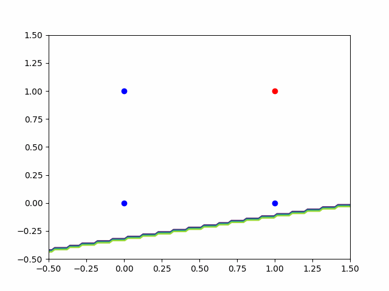
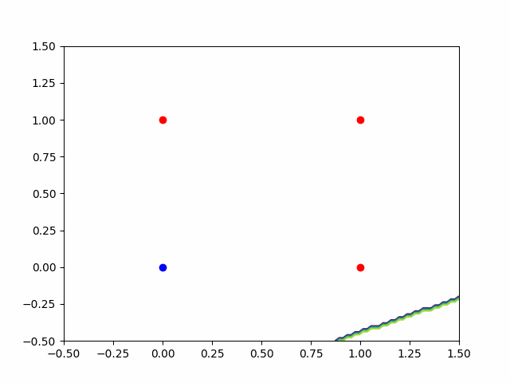
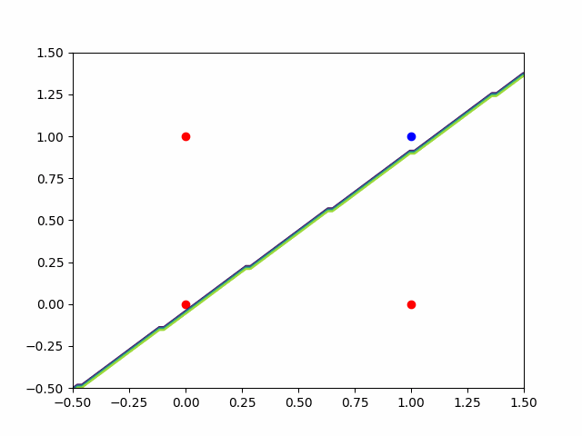
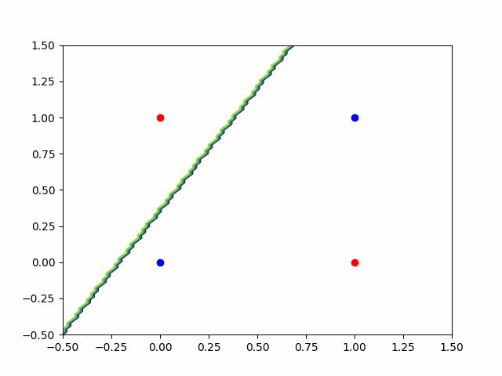
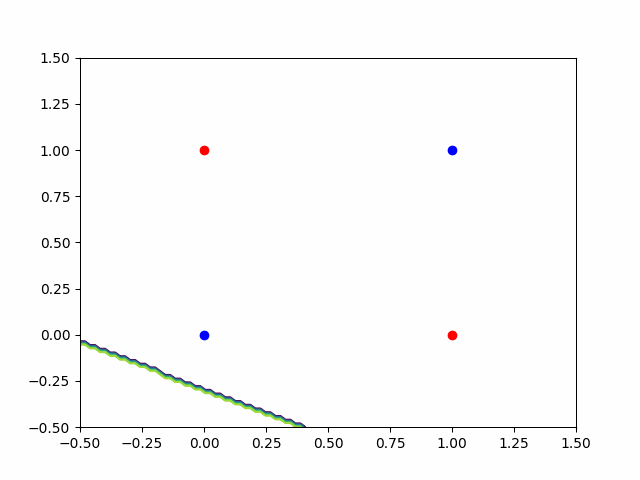

# nerf_pytorch

Pytorch implementation of XOR problem 

### How to run

run making_gif_with_plt_annimation.py

### 1 layer

#### and prob

#### or prob

#### nand prob

#### xor prob

# 2 layer

#### xor prob

